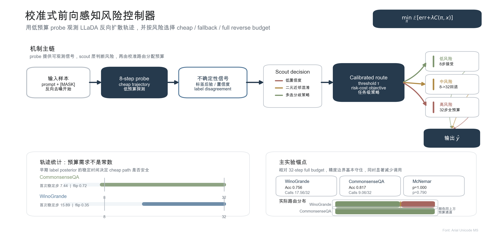

# TARDI-DLLM

**Task-Aware Reverse Diffusion Inference for Diffusion Large Language Models**

TARDI-DLLM contains the code, result tables, and notes for a small study of
**masked diffusion language models on downstream discriminative tasks**. Most
experiments use `LLaDA-8B-Instruct` and compare fixed-step sampling with
task-aware reverse-diffusion inference.

The main controller is a **Selective Re-masking Refinement Controller**:

1. run a lightweight forward label probe;
2. perform an 8-step reverse-diffusion scout;
3. estimate sample risk from probe uncertainty, trajectory changes, validity,
   fill confidence, and task shape;
4. allocate a budget from `{8, 16, 24, 32}`;
5. selectively re-mask low-confidence positions before additional denoising.



## Result Snapshot

Final 11-task comparison, `limit=50`, `seed=23`:

| Method | Macro accuracy | Avg. forward calls | Relative calls vs. 32-step |
|---|---:|---:|---:|
| **TARDI / ours** | **0.658** | **17.56** | **-45.1%** |
| Fixed 32-step | 0.658 | 32.00 | 0.0% |
| Previous refinement controller | 0.658 | 26.92 | -15.9% |
| JYS-like 16-step | 0.644 | 16.00 | -50.0% |
| Prophet-like early commit | 0.647 | 30.44 | -4.9% |

Source table:

```text
results/domain_shift/task_aware/solid_v2/v3_choice_fast/tables/v3plus_macro_comparison_limit50_seed23.csv
```

The fixed-step sweep used to analyze how task accuracy changes with diffusion
steps is stored at:

```text
results/domain_shift/task_aware/solid_v2/step_sweep_limit20_4to32/tables/step_sweep_4to32_by_dataset_limit20_seed23.csv
```

## Repository Layout

```text
.
├── scripts/                         # Evaluation, controller, LoRA, and analysis scripts
├── llada_eval/scripts/              # Additional sampler-variant entry point
├── results/domain_shift/task_aware/ # Raw outputs, logs, tables, reports
├── figures/                         # Method figures and exported diagrams
├── external/                        # MDM reproduction submodule location
├── llada-swiss-ppt/                 # HTML slide visualization assets
├── LLaDA_*.md                       # Experiment reports and research notes
├── CTMC_Discrete_Diffusion_中文调研报告.md
└── LLaDA_final_data_pack_20260529.tar.gz
```

Important reports:

- `LLaDA_Selective_Remask_Refinement_Controller.md` describes the final
  controller design.
- `LLaDA_Final_Experiment_Data_Report.md` summarizes the latest result tables
  and fixed-step sweep.
- `LLaDA_Solid_Experiment_Report.md` records the solid-v2 experiment suite.
- `CTMC_Discrete_Diffusion_中文调研报告.md` provides background on CTMC-style
  discrete diffusion and masked diffusion models.

## Setup

The scripts are research scripts intended for a CUDA machine with local model
checkpoints. The original runs used paths such as:

```text
/data/hf/models/GSAI-ML/LLaDA-8B-Instruct
/data/hf/models/Qwen/Qwen2.5-7B-Instruct
```

Install the Python dependencies used by the experiment scripts:

```bash
python -m venv venv
source venv/bin/activate
pip install torch transformers==4.57.6 datasets accelerate safetensors \
  sentencepiece protobuf peft tqdm scipy matplotlib pandas huggingface_hub
```

Initialize the included MDM reproduction submodule when needed:

```bash
git submodule update --init --recursive
```

## Running the Main Controller

Example invocation for the selective re-masking refinement controller:

```bash
python scripts/eval_llada_refinement_controller.py \
  --model /path/to/GSAI-ML/LLaDA-8B-Instruct \
  --tasks winogrande,commonsenseqa,arc_challenge,hellaswag,boolq \
  --limit 50 \
  --seed 23 \
  --budgets 8,16,24,32 \
  --risk-t16 0.24 \
  --risk-t24 0.38 \
  --risk-t32 0.56 \
  --multi-disagreement-policy ignore \
  --out results/domain_shift/task_aware/solid_v2/raw/example_refinement.json
```

For the original cluster-style queues, see:

- `scripts/solid_v2_run_a100_priority.sh`
- `scripts/solid_v2_run_clean_retest.sh`
- `scripts/solid_v2_run_external_sampler_baselines.sh`
- `scripts/solid_v2_run_lora_control_v2.sh`
- `scripts/solid_v2_run_coverage_addendum.sh`

These shell scripts contain project-specific paths (`/data/llada_eval`,
`/data/hf/models/...`) and should be edited before running on another machine.

## Analysis Entry Points

Common analysis scripts:

```bash
python scripts/solid_v2_analyze.py \
  --root results/domain_shift/task_aware/solid_v2 \
  --legacy-domain-root results/domain_shift

python scripts/analyze_coverage_addendum.py \
  --root results/domain_shift/task_aware/solid_v2/coverage_addendum

python scripts/analyze_lora_control_v2.py \
  --root results/domain_shift/task_aware/solid_v2

python scripts/audit_eval_outputs.py \
  results/domain_shift/task_aware/solid_v2/raw \
  --out results/domain_shift/task_aware/solid_v2/tables/output_audit.csv
```

## Data and Outputs

The repository includes the files used for the reported experiments:

- raw JSON evaluation outputs;
- summary CSV/JSON tables;
- analysis logs;
- Chinese experiment reports;
- exported method figures;
- an archived local data pack:

```text
LLaDA_final_data_pack_20260529.tar.gz
```

Large model checkpoints are **not** included. Dataset loading is handled by the
evaluation scripts and depends on the corresponding Hugging Face/dataset access
available in the runtime environment.

## Scope

This is a research-code repository, not a packaged library. The scripts, raw
outputs, tables, and reports are kept together so that the accuracy--cost
numbers can be checked against the corresponding runs.
