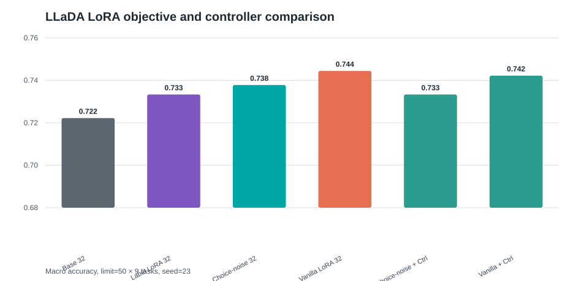
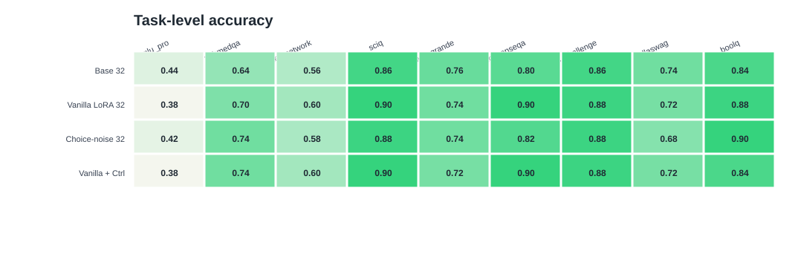
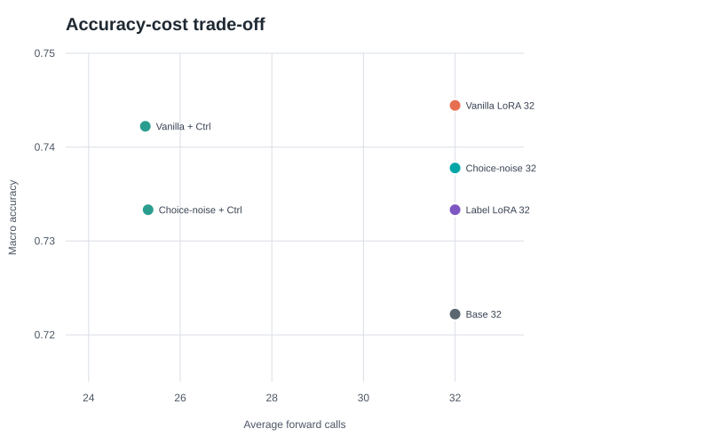
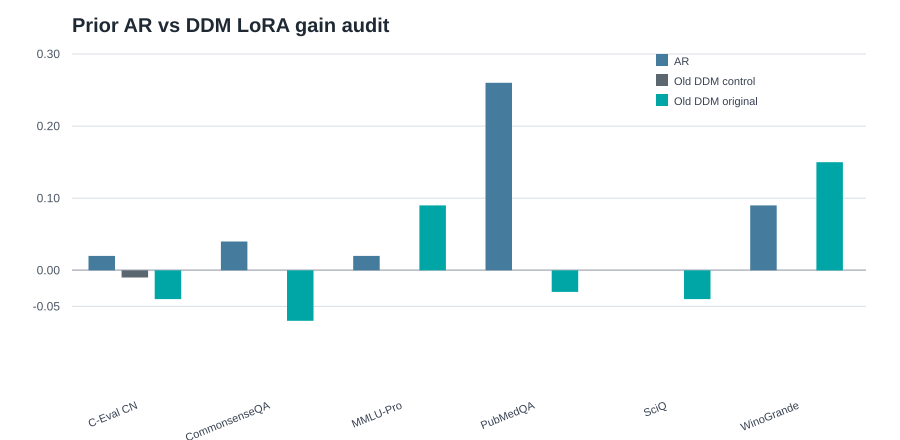

# TARDI-DLLM 最终综合实验报告

## 1. 任务目标

本项目围绕 masked diffusion language model 在 fixed-label reasoning 任务上的适配与推理控制展开。核心问题不是重新训练 LLaDA，也不是声称修改 LLaDA backbone，而是回答：

> 对于选择题、判断题、医学问答、中文知识题等固定标签任务，LLaDA 的训练侧适配目标和推理侧反向扩散预算是否存在错位？如果存在，能否用 LoRA objective 和 selective re-masking controller 改善？

本轮新服务器实验完成了两个主实验：

1. **改进 LoRA 实验**：比较 base、vanilla denoising LoRA、label-focused LoRA、choice-noise LoRA。
2. **LoRA + 选择性再修掩码器实验**：在 LoRA 后接入 selective re-masking controller，评估 accuracy-cost trade-off。

同时，本报告接入已有 solid_v2 中的 AR/Qwen LoRA audit 和 related sampler baseline，形成完整对照。

## 2. 实验环境与数据

远端实验目录：

```text
/data/llada_eval/results/domain_shift/task_aware/choice_noise_v1/
```

本地同步目录：

```text
results/domain_shift/task_aware/choice_noise_v1/
```

新服务器远端仓库：

```text
/data/llada_eval
origin = https://github.com/Trace231/TARDI-DLLM.git
commit = e688726
```

主模型：

```text
/data/hf/models/GSAI-ML/LLaDA-8B-Instruct
```

新 LoRA/controller 实验覆盖 9 个任务，每任务 `limit=50`，总计 450 条样本：

```text
mmlu_pro, pubmedqa, ceval_computer_network, sciq,
winogrande, commonsenseqa, arc_challenge, hellaswag, boolq
```

## 3. 方法概述

### 3.1 训练侧：DDM LoRA objective

比较三种 LoRA：

| Adapter | Objective | 目的 |
|---|---|---|
| Vanilla LoRA | denoising only | 普通 DDM LoRA 基线 |
| Label-focused LoRA | choice posterior + denoise | 检验 final-label objective mismatch |
| Choice-noise LoRA | choice + denoise + cross-noise consistency | 检验 noise-stage regularization 是否改善任务偏置 |

Choice-aware objective 作用在合法标签空间：

```text
Y(x) = {A, B, C, D, ...}
```

或：

```text
Y(x) = {yes, no}, {yes, no, maybe}
```

核心思想是让 LoRA 梯度直接作用于：

```text
p(label | prompt, "Final answer: [MASK]")
```

而不是只被完整 completion 的普通去噪目标摊薄。

### 3.2 推理侧：Selective Re-masking Controller

controller 将反向扩散步数视作样本级预算分配问题：

```text
K(x) in {8, 16, 24, 32}
```

它根据 forward probe、8-step scout、label validity、风险分数和低置信 token 位置决定是否追加 denoising。追加时不是完全重跑，而是把低置信位置重新 mask 后继续修复。

## 4. 新实验主结果



| Method | Macro Acc. | Correct / N | Avg calls | 说明 |
|---|---:|---:|---:|---|
| LLaDA vanilla LoRA fixed-32 | 0.744 | 335 / 450 | 32.00 | 当前最高准确率 |
| LLaDA vanilla LoRA + controller | 0.742 | 334 / 450 | 25.24 | 最佳质量-成本折中 |
| LLaDA choice-noise LoRA fixed-32 | 0.738 | 332 / 450 | 32.00 | 方法设计版 adapter |
| LLaDA label-focused LoRA fixed-32 | 0.733 | 330 / 450 | 32.00 | final-label posterior ablation |
| LLaDA choice-noise LoRA + controller | 0.733 | 330 / 450 | 25.30 | 方法设计版 + 省算 |
| LLaDA base fixed-32 | 0.722 | 325 / 450 | 32.00 | 基础线 |

主要结论：

1. DDM LoRA 可以有效提升 fixed-label reasoning。base fixed-32 为 `0.722`，最强 LoRA fixed-32 达到 `0.744`。
2. Vanilla denoising LoRA 在这批任务上 overall 最强，说明 DDM LoRA 的普通去噪适配本身有价值。
3. Choice-noise LoRA 不是 overall 最强，但相对 vanilla 在 PubMedQA、BoolQ 和 MMLU 损失控制上更有优势，说明 choice posterior 与 noise-stage regularization 会改变任务偏置。
4. Vanilla LoRA + controller 几乎保持 full-budget LoRA 的准确率，从 `0.744` 到 `0.742`，同时 avg calls 从 32 降到 `25.24`，约省 `21.1%`。

## 5. 逐任务结果



| Task | Base | Vanilla LoRA | Choice-noise LoRA | Vanilla + Controller |
|---|---:|---:|---:|---:|
| MMLU-Pro | 0.44 | 0.38 | 0.42 | 0.38 |
| PubMedQA | 0.64 | 0.70 | 0.74 | 0.74 |
| C-Eval CN | 0.56 | 0.60 | 0.58 | 0.60 |
| SciQ | 0.86 | 0.90 | 0.88 | 0.90 |
| WinoGrande | 0.76 | 0.74 | 0.74 | 0.72 |
| CommonsenseQA | 0.80 | 0.90 | 0.82 | 0.90 |
| ARC-Challenge | 0.86 | 0.88 | 0.88 | 0.88 |
| HellaSwag | 0.74 | 0.72 | 0.68 | 0.72 |
| BoolQ | 0.84 | 0.88 | 0.90 | 0.84 |

解释：

- **PubMedQA**：choice-noise 和 controller 后均达到 `0.74`，比 base `0.64` 高 10 个点。这说明标签 posterior 对医学 yes/no/maybe 校准有帮助。
- **CommonsenseQA / SciQ**：vanilla LoRA 很强，说明普通 denoising adaptation 对短选择题有效。
- **MMLU-Pro / HellaSwag / WinoGrande**：部分 LoRA 有负迁移，说明 fixed-label LoRA 不是知识注入，也不是所有任务的万能增强。
- **BoolQ**：choice-noise fixed-32 达到 `0.90`，但 controller 后 vanilla 版本回到 `0.84`，说明二分类早停在某些样本上仍有校准风险。

## 6. Accuracy-cost Trade-off



Controller 的行为具有明显任务依赖：

| Task | Choice-noise + Ctrl Acc. | Calls | Vanilla + Ctrl Acc. | Calls |
|---|---:|---:|---:|---:|
| MMLU-Pro | 0.42 | 32.50 | 0.38 | 32.64 |
| PubMedQA | 0.74 | 33.00 | 0.74 | 33.00 |
| C-Eval CN | 0.58 | 33.00 | 0.60 | 33.00 |
| SciQ | 0.88 | 33.00 | 0.90 | 33.00 |
| WinoGrande | 0.74 | 10.44 | 0.72 | 10.12 |
| CommonsenseQA | 0.82 | 8.98 | 0.90 | 9.26 |
| ARC-Challenge | 0.88 | 33.00 | 0.88 | 33.00 |
| HellaSwag | 0.68 | 33.00 | 0.72 | 33.00 |
| BoolQ | 0.86 | 10.76 | 0.84 | 10.12 |

这说明 controller 不是简单 early stopping：

- 高基数、长上下文或高风险任务保持 full budget。
- WinoGrande、CommonsenseQA、BoolQ 大量走 8/16/24。
- 最终全局平均调用降到约 25.2，而不是所有任务无差别压缩。

## 7. AR/Qwen LoRA 与旧 DDM LoRA Audit



已有 solid_v2 中的 AR/Qwen 对照显示：

| Model | Protocol | 现象 |
|---|---|---|
| Qwen2.5-7B base vs LoRA | 6 任务，每任务 100 | AR LoRA 通常有明显增益，PubMedQA +0.26，WinoGrande +0.09，CQA +0.04 |
| 旧 LLaDA control LoRA | 6 任务，每任务 100 | 大多接近 0 增益，甚至 C-Eval 略降 |
| 旧 LLaDA original LoRA | 6 任务，每任务 100 | 任务间波动大，Wino/MMLU 有提升，但 PubMed/SciQ/CQA 下降 |

这和本轮新实验形成一个完整故事：

1. 初始 audit 发现：AR LoRA 能稳定把 final-label supervision 转化成 accuracy gain，旧 DDM LoRA 不稳定。
2. 诊断：DDM LoRA 的训练信号和 final-label decision boundary 可能错位。
3. 修正：重新构造 fixed-label denoising / choice posterior 训练后，新 LLaDA LoRA 在 9 任务上超过 base。
4. 推理控制：适配后仍有样本级 reverse budget heterogeneity，因此 controller 可以进一步省算。

## 8. External Improved LoRA Baseline

为避免训练侧贡献只停留在自家消融，本轮补充复现并比较了多种 LoRA 改良方法：rsLoRA、DoRA、LoRA+ 与 NaRA-style noise-aware adapter。所有方法使用相同 LLaDA-8B-Instruct、相同 fixed-label prompt、相同 9 个任务、相同 `limit=50` 和 `seed=23`，并统一使用 32-step fixed-label evaluation。

| Method | Macro Acc. | Correct / N | 解释 |
|---|---:|---:|---|
| Vanilla LoRA fixed-32 | 0.744 | 335 / 450 | 并列最高 |
| NaRA-style vanilla fixed-32 | 0.744 | 335 / 450 | 并列最高 |
| Vanilla LoRA + controller | 0.742 | 334 / 450 | 接近最高且省算 |
| LoRA+ vanilla fixed-32 | 0.742 | 334 / 450 | 接近最高 |
| NaRA-style choice-noise fixed-32 | 0.740 | 333 / 450 | 低于 NaRA vanilla |
| Choice-noise LoRA fixed-32 | 0.738 | 332 / 450 | 低于 vanilla |
| rsLoRA vanilla fixed-32 | 0.736 | 331 / 450 | 低于 vanilla |
| Label-focused LoRA fixed-32 | 0.733 | 330 / 450 | 负结果 |
| DoRA vanilla fixed-32 | 0.733 | 330 / 450 | 低于 vanilla |
| Base fixed-32 | 0.722 | 325 / 450 | 基础线 |

这组结果改变了训练侧叙事：不能声称 choice-noise LoRA 全面超过现有 LoRA 改良。更稳的结论是，通用 improved LoRA 并不会自动解决 masked diffusion LM 的 fixed-label reasoning 适配；NaRA-style 的 noise-aware 结构可以达到 vanilla LoRA 水平，但额外的 choice/noise objective 在当前规模下没有稳定提升。

因此最终贡献应收束为：

1. 训练侧给出系统诊断：DDM LoRA objective 会改变任务偏置，但 choice-aware/label-focused 目标短训下存在负迁移。
2. Related LoRA baseline 已补齐：rsLoRA、DoRA、LoRA+、NaRA-style 均在同一协议下比较。
3. 推理侧是稳定正结果：controller 在 0.742 macro accuracy 下接近最高 0.744，同时保持此前约 21% forward-call 节省。

完整 external LoRA 结果见：

```text
External_LoRA_Baseline_Final_Results.md
results/domain_shift/task_aware/lora_external_v1/
```

## 9. Related Sampler Baseline

已有 solid_v2 的 sampler baseline 覆盖 11 任务、每任务 50：

| Method | Macro Acc. | Avg calls |
|---|---:|---:|
| fixed32 | 0.658 | 32.00 |
| JYS-like middle-16 | 0.644 | 16.00 |
| Prophet-like early commit | 0.647 | 30.44 |
| refinement | 0.658 | 26.92 |
| ours_v3plus | 0.658 | 17.56 |

这说明“减少采样步数”本身不是新颖点。我们的贡献应写成更窄的：

> condition-aware reverse budget allocation for fixed-label reasoning, combined with DDM LoRA adaptation.

也就是说，controller 的价值不是“我也能 early stop”，而是它和训练侧 fixed-label adaptation 共同解决 DDM 下游选择题的两个错位。

## 10. 最推荐的 Pre 叙事

建议不要说：

```text
我们提出的 choice-noise LoRA 全面超过所有 LoRA。
```

建议说：

```text
我们发现 masked diffusion LM 在 fixed-label reasoning 上存在训练侧和推理侧两个错位。
训练侧，DDM LoRA 的 objective 会显著影响任务偏置。普通 denoising LoRA overall 最强，
choice-noise objective 在医学/二分类校准与高基数任务损失控制上更有解释性。
推理侧，适配后的 LLaDA 仍然存在样本级 reverse budget heterogeneity，
selective re-masking controller 可以在几乎不损失准确率的前提下降低约 21% 平均 forward calls。
```

最终贡献可以写成三点：

1. **诊断**：AR LoRA 与旧 DDM LoRA 的增益差异说明 DDM fixed-label adaptation 不能照搬 AR SFT。
2. **训练侧实验**：比较 vanilla、label-focused、choice-noise 三种 DDM LoRA objective，证明 DDM LoRA 可以提升固定标签任务，但 objective 决定任务偏置。
3. **推理侧控制**：在 LoRA 后接入 selective re-masking controller，实现几乎保分的推理预算压缩。

## 11. 局限性

1. 新 LoRA/controller 实验为 `limit=50 × 9 tasks`，样本量比 1000 样本主对照小，适合 course project/pre，不应夸成大规模 benchmark SOTA。
2. Vanilla LoRA overall 最强，choice-noise 目前不是全局最优 objective。后续可做 balanced loss sweep，例如提高 denoise weight、降低 consistency weight。
3. Controller 对高风险任务保守，因此全局平均 calls 下降约 21%，不是 40% 以上；但这也说明它不是盲目压缩。
4. 方法没有修改 LLaDA 架构。LoRA 是参数高效适配，controller 是 inference-loop 改进。

## 12. 文件索引

新实验主表：

```text
results/domain_shift/task_aware/choice_noise_v1/tables/choice_noise_macro_summary.csv
results/domain_shift/task_aware/choice_noise_v1/tables/choice_noise_task_summary.csv
results/domain_shift/task_aware/choice_noise_v1/tables/choice_noise_summary.json
```

新实验原始 JSON：

```text
results/domain_shift/task_aware/choice_noise_v1/raw/
```

新实验日志：

```text
results/domain_shift/task_aware/choice_noise_v1/logs/
```

图表：

```text
results/domain_shift/task_aware/choice_noise_v1/figures/
```

方法说明：

```text
Choice_Noise_LoRA_and_Remask_Controller_Method.md
```

新结果速报：

```text
Choice_Noise_LoRA_Controller_Final_Results.md
```
