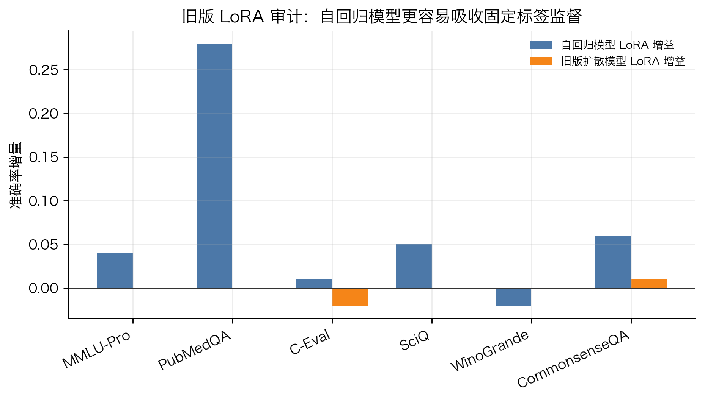
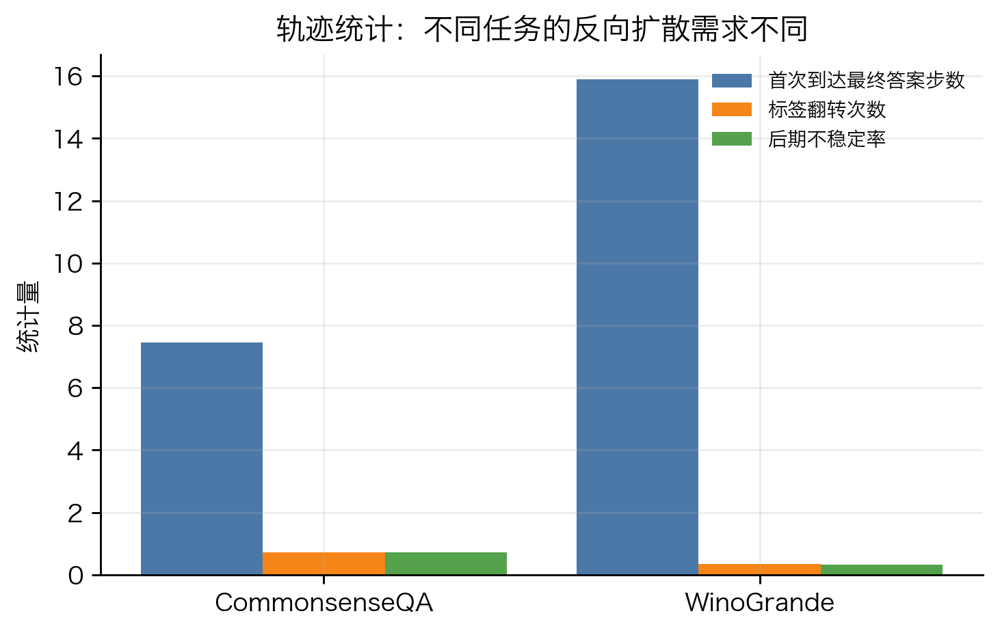

# 面向固定标签推理的掩码扩散语言模型适配与反向推理控制

## 摘要

本项目研究掩码扩散语言模型在固定标签下游任务中的训练适配与推理控制问题。与自回归语言模型不同，LLaDA 这类模型通过多步反向去噪从高噪声文本状态恢复答案，因此最终标签分布不仅由模型知识决定，也受到噪声阶段、反向扩散步数、标签轨迹稳定性和推理预算分配的影响。

我们不声称修改 LLaDA 主体结构。本文的主线是两个错位问题：第一，普通 LoRA 微调的训练分布和固定标签评测分布不一致；第二，固定步数采样无法适应不同样本的反向去噪难度。针对第一个问题，我们提出 TARDI-LoRA，即任务均衡、评测去重、高噪声终标签去噪的参数高效适配协议。它将 9 个任务的宏平均准确率从基础模型的 `0.722` 提升到 `0.776`，相比旧版 LoRA 的 `0.744` 也有稳定提升。针对第二个问题，我们提出校准的前向感知风险控制器与选择性再掩码修正机制，在 WinoGrande 和 CommonsenseQA 的 1000 样本主实验中，以显著更少的平均前向调用接近或保持 32 步满预算结果。

最终结论是：掩码扩散语言模型的下游能力边界不能只从模型参数解释，也必须分析反向扩散轨迹本身。训练侧需要让数据覆盖、标签格式和噪声阶段与评测目标对齐；推理侧需要把固定采样过程改造成可观测、可校准、可控成本的决策过程。

## 术语校正

严格说，最终可作为主线的 LoRA 创新点不是“任务感知 LoRA 架构”。我们确实实现并测试过任务条件化的 LoRA 变体，但它没有超过更简单的 TARDI-LoRA，因此不应把它写成主要贡献。

更规范的表述是：

- 训练侧贡献：面向固定标签推理的任务均衡与高噪声终标签去噪适配协议。
- 推理侧贡献：基于反向扩散轨迹风险的选择性再掩码推理控制。
- 边界分析：任务条件化适配器可以作为补充消融，但不是最终主方法。

因此本文后续只把任务条件化适配器作为验证“复杂结构不一定带来稳定收益”的消融结果，不把它放在贡献标题中。

## 研究问题

设输入为 \(x\)，固定标签空间为 \(\mathcal{Y}(x)\)，例如多选题的 A 到 D、判断题的 yes/no，或医学问答的 yes/no/maybe。自回归模型通常直接学习

```text
p(y | x)
```

而掩码扩散语言模型在推理时需要经过多步反向去噪，最终答案是一个多步转移过程后的 hitting distribution。简化地说：

```text
z_T -> z_{T-1} -> ... -> z_0 -> y
```

这带来两个问题：

1. 训练侧，普通 LoRA 可能优化的是一般文本去噪，而不是固定标签位置上的最终决策边界。
2. 推理侧，固定 32 步或固定 8 步假设所有样本的反向去噪难度相同，但轨迹分析显示这个假设并不成立。

本文要回答的是：能否通过训练侧适配协议和推理侧风险控制，让 LLaDA 更稳定地服务于固定标签任务？

## 方法总览

方法由两部分组成。

第一部分是 TARDI-LoRA。它不是新的 LLaDA 主体结构，而是一个适配协议：

- 训练集覆盖评测中的 9 类任务，而不是只覆盖少数任务。
- 训练样本与评测样本按编号去重，避免把评测样本混入训练。
- 在高噪声比例下训练终标签去噪，使训练阶段更接近 LLaDA 推理时从掩码答案恢复最终标签的状态。

第二部分是选择性再掩码推理控制。它先运行低预算侦察轨迹，再依据风险决定是否追加预算。若样本风险较低，则直接接受低预算答案；若风险较高，则对低置信位置再掩码并追加反向去噪预算。

可以把推理策略写成一个带成本项的决策问题：

```text
K*(x) = argmin_K E[L(y_K, y*) | trajectory_8(x)] + lambda K
```

其中 \(K\) 是反向扩散预算，\(\lambda K\) 是推理成本。与单纯提前停止不同，我们关心的是由轨迹不确定性估计继续去噪的边际收益。


## 实验设置

主模型为 LLaDA-8B-Instruct。训练侧 LoRA 实验覆盖 9 个固定标签任务，每个任务 50 条评测样本，共 450 条。任务包括 MMLU-Pro、PubMedQA、C-Eval、SciQ、WinoGrande、CommonsenseQA、ARC-Challenge、HellaSwag 和 BoolQ。

推理控制主实验使用 WinoGrande 和 CommonsenseQA，各 1000 条样本。阈值稳定性实验使用每任务 500 条样本。边界负例使用 PubMedQA 和 C-Eval。扩展覆盖实验加入 ARC-Challenge、HellaSwag、BoolQ 和 GSM8K，以检查结论是否局限于原始选择题集合。

所有关键输出统一整理在：

```text
writing/tables/
writing/figures/
```

## 训练侧结果：TARDI-LoRA

图 1 展示了训练侧主要消融。基础 LLaDA 在 9 个任务上的宏平均准确率为 `0.722`。旧版 LoRA 达到 `0.744`。仅做任务均衡后提升到 `0.760`。加入高噪声终标签去噪后，TARDI-LoRA 达到 `0.776`，与 r16 配置相同。


| 方法 | 正确数 | 样本数 | 宏平均准确率 | 相对基础模型 |
|---|---:|---:|---:|---:|
| 基础模型 | 325 | 450 | 0.722 | +0.000 |
| 旧版 LoRA | 335 | 450 | 0.744 | +0.022 |
| 任务均衡 LoRA | 342 | 450 | 0.760 | +0.038 |
| TARDI-LoRA | 349 | 450 | 0.776 | +0.053 |
| TARDI-LoRA(r16) | 349 | 450 | 0.776 | +0.053 |

这个结果支持一个比较稳的训练侧主张：固定标签任务中的 DDM LoRA 失败不一定来自 LoRA 容量不足，而常常来自训练覆盖、噪声阶段和评测格式错位。TARDI-LoRA 的作用是修正这些错位，而不是堆叠复杂适配器结构。

逐任务结果如图 2 所示。TARDI-LoRA 在 PubMedQA、SciQ、CommonsenseQA、HellaSwag、BoolQ 等任务上有稳定收益，但在 MMLU-Pro 上没有超过基础模型。这说明 LoRA 适配主要改善固定标签决策和格式化推理，不等价于注入新知识。


## 为什么不强调任务条件化 LoRA

我们实现过两类任务条件化 LoRA 消融：一种是直接将任务嵌入和噪声嵌入拼接，另一种是共享噪声核心加受控任务残差。结果如下：

| 方法 | 宏平均准确率 | 正确数 |
|---|---:|---:|
| TARDI-LoRA | 0.776 | 349 / 450 |
| 任务条件化消融 | 0.773 | 348 / 450 |
| 残差任务条件化消融 | 0.769 | 346 / 450 |

这些结果说明任务条件化不是没有信号，但它不是最终最强方法。它在 WinoGrande 和 PubMedQA 上有局部收益，却会损失 ARC-Challenge、HellaSwag 和 BoolQ。因此报告中不把它写成创新点，只把它作为消融结论：在当前小规模固定标签适配下，任务覆盖与噪声阶段对齐比复杂任务条件化结构更关键。

## 与自回归 LoRA 的对照

旧版 LoRA 审计显示，在同一批固定标签任务上，自回归模型更容易把标签监督转化为准确率提升，而旧版扩散模型 LoRA 的增益较弱。这是我们设计 TARDI-LoRA 的动机之一。



这个现象可以从训练目标解释：自回归 LoRA 直接扰动最终答案 token 的条件分布，而扩散模型 LoRA 扰动的是不同噪声阶段的一族反向转移分布。最终答案是多步转移复合后的结果，所以小规模低秩更新未必能稳定改变最终标签边缘分布。

## 推理侧结果：校准风险控制

在 1000 样本主实验中，32 步满预算是强基线。早期自适应方法很省算力，但在 WinoGrande 上准确率从 `0.756` 降到 `0.736`。校准控制器在 WinoGrande 上保持 `0.756`，平均调用次数从 32 降到 `17.56`；在 CommonsenseQA 上达到 `0.817`，接近 32 步的 `0.819`，平均调用次数降到 `9.064`。


| 方法 | 任务 | 准确率 | 正确数 | 样本数 | 平均调用次数 |
|---|---|---:|---:|---:|---:|
| 32 步满预算 | WinoGrande | 0.756 | 756 | 1000 | 32.00 |
| 32 步满预算 | CommonsenseQA | 0.819 | 819 | 1000 | 32.00 |
| 早期自适应 | WinoGrande | 0.736 | 736 | 1000 | 9.36 |
| 早期自适应 | CommonsenseQA | 0.816 | 816 | 1000 | 9.86 |
| 前向感知 | WinoGrande | 0.756 | 756 | 1000 | 17.56 |
| 前向感知 | CommonsenseQA | 0.818 | 818 | 1000 | 10.82 |
| 校准控制器 | WinoGrande | 0.756 | 756 | 1000 | 17.56 |
| 校准控制器 | CommonsenseQA | 0.817 | 817 | 1000 | 9.06 |

配对检验也支持这一点。校准控制器与 32 步满预算相比，在 WinoGrande 上两边各只独有 3 个正确样本，McNemar 检验 \(p=1.0\)。在 CommonsenseQA 上，32 步独有 8 个正确样本，控制器独有 6 个正确样本，\(p=0.7905\)。与早期自适应相比，校准控制器在 WinoGrande 上显著更好，\(p=0.0225\)。

## 阈值稳健性

阈值扫描表明，阈值不是单点拍脑袋。WinoGrande 中，阈值从 0.60 到 0.80 时，准确率基本保持在 `0.754` 到 `0.756`，调用次数随阈值升高从 `15.70` 增加到 `22.94`。CommonsenseQA 在这些阈值下准确率稳定为 `0.812`，平均调用次数约为 9。


这说明阈值控制的主要作用是调节保守程度，而不是制造单点偶然提升。

## 轨迹分析

轨迹记录器显示，不同任务达到最终答案的时间分布明显不同。CommonsenseQA 的平均首次到达最终答案步数为 `7.44`，而 WinoGrande 为 `15.89`。这说明 WinoGrande 更依赖较长的语义绑定过程，CommonsenseQA 更容易在早期形成稳定标签。



这个结果支撑了选择性再掩码控制的理论动机：统一固定步数并不合理，反向扩散预算应由轨迹风险决定。

## 选择性再掩码修正

选择性再掩码修正不是简单提前停止。它包含三个步骤：

1. 用低预算轨迹获得初始答案和置信度。
2. 根据标签合法性、置信度、边际差、答案翻转和任务统计估计风险。
3. 对低置信位置重新掩码，追加中等或满预算去噪。

这种机制的目标不是在所有任务上都压缩到 8 步，而是在能压缩的样本上节省预算，在高风险样本上保守回退。9 任务快速覆盖实验中，选择性再修控制器与 32 步满预算的宏平均准确率相同，均为 `0.658`，平均调用次数从 `32.00` 降到 `26.92`。相比固定 16 步调度的 `0.644` 和早停式方法的 `0.647`，选择性再修更稳。

| 方法 | 11 任务宏平均准确率 | 平均调用次数 |
|---|---:|---:|
| 32 步满预算 | 0.658 | 32.00 |
| 固定 16 步调度 | 0.644 | 16.00 |
| 早停式方法 | 0.647 | 30.44 |
| 选择性再修控制器 | 0.658 | 26.92 |

在 LoRA 后模型上，选择性再修也保留了主要收益：旧版 LoRA 32 步为 `0.744`，LoRA 加控制器为 `0.742`，平均调用次数为 `25.24`，约减少 21% 的调用。

## 边界负例

PubMedQA 和 C-Eval 说明预算控制不是万能的。PubMedQA 从 8 步 `0.557` 到 32 步 `0.660`，说明医学判断任务对反向轨迹预算敏感；校准控制器在该任务上选择全 32 步，准确率 `0.680`。C-Eval 中 8 步和 32 步都为 `0.585`，说明瓶颈更像知识缺口或专业领域能力，而不是采样步数。


因此本文的边界非常明确：采样控制能处理轨迹敏感型错误，但不能替代知识增强或领域训练。

## 扩展任务覆盖

扩展任务显示，预算敏感性并不只出现在 WinoGrande 和 CommonsenseQA。GSM8K 从 8 步到 32 步提升 26 个百分点，说明长链数值推理高度依赖反向预算；ARC-Challenge、HellaSwag 和 BoolQ 也有 2 到 3 个点的 32 步收益。另一方面，Qwen2.5-7B 在 ARC、HellaSwag 和 GSM8K 上更强，说明 LLaDA 并非全面优于自回归模型。


步数扫描进一步说明，不同数据集的准确率随扩散步数变化并不一致。


这使得本文主张更加具体：我们不是声称 LLaDA 在所有任务上更强，而是说明 LLaDA 的反向轨迹具有可观测和可控制的任务依赖性。

## 理论解释

从离散扩散角度看，LLaDA 的反向推理可以看作在离散 token 状态空间上的反向马尔可夫过程。固定步数采样默认每个样本的 hitting time 分布相近，但实验显示不同任务的首次到达最终答案步数、标签翻转次数和后期不稳定性不同。

因此选择性再掩码控制器可以解释为带成本的风险最小化：

```text
R(pi) = E[1{y_pi(x) != y*}] + lambda E[C_pi(x)]
```

其中策略 \(\pi\) 不直接改变模型参数，而是根据低预算轨迹选择继续去噪的位置和预算。TARDI-LoRA 则作用在训练侧，使适配阶段更接近固定标签评测中的高噪声答案恢复过程。两者分别处理训练分布错位和推理预算错位。

## 最终贡献表述

建议在汇报中写成三点：

1. 提出 TARDI-LoRA。它通过任务均衡、评测去重和高噪声终标签去噪，修正掩码扩散模型在固定标签推理中的训练与评测错位。
2. 提出选择性再掩码推理控制。它利用低预算反向轨迹估计样本风险，在保持满预算行为边界的同时减少平均推理成本。
3. 给出系统边界分析。通过 PubMedQA、C-Eval、GSM8K 和扩展任务实验说明，采样控制只解决轨迹敏感型错误，不能替代知识增强；LLaDA 与自回归模型的差异应从反向轨迹和任务预算需求解释。

不建议写成：

- 我们改进了 LLaDA 架构。
- 我们提出任务感知 LoRA 并全面超过所有基线。
- 我们提出通用自适应采样并适用于所有任务。

## 面向展示的结论

如果做 PPT，可以把主线压缩成一句话：

> 我们没有把 LLaDA 改成另一个模型，而是让它在固定标签任务中“训得更对齐、推得更会省”：训练侧用 TARDI-LoRA 对齐任务覆盖和高噪声答案恢复，推理侧用选择性再掩码控制把反向扩散轨迹变成可观测、可校准、可控成本的决策过程。

## 文件索引

图表：

```text
writing/figures/
```

整理后的数据表：

```text
writing/tables/
```

原始主要数据：

```text
results/domain_shift/task_aware/lora_opt_v1/
results/domain_shift/task_aware/solid_v2/
results/domain_shift/task_aware/choice_noise_v1/
```
