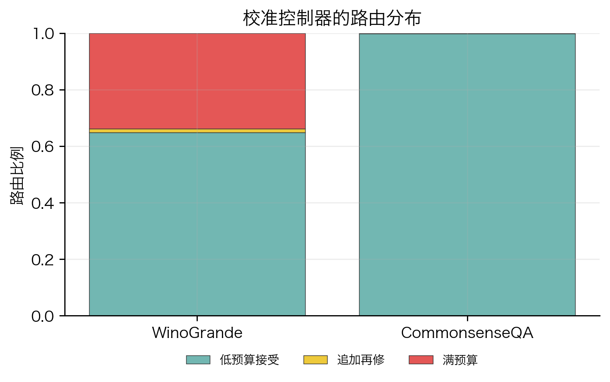
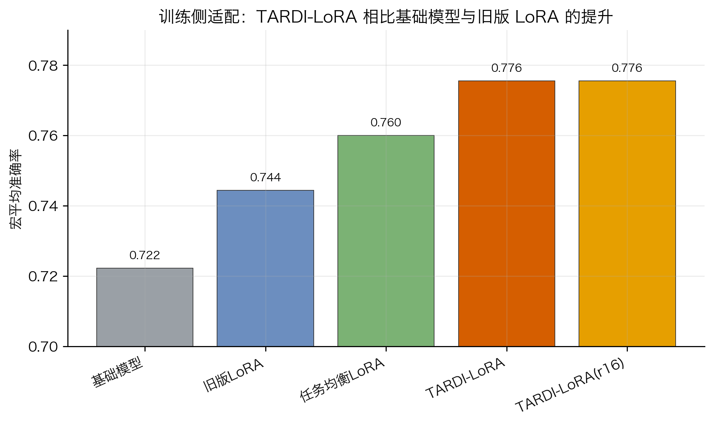
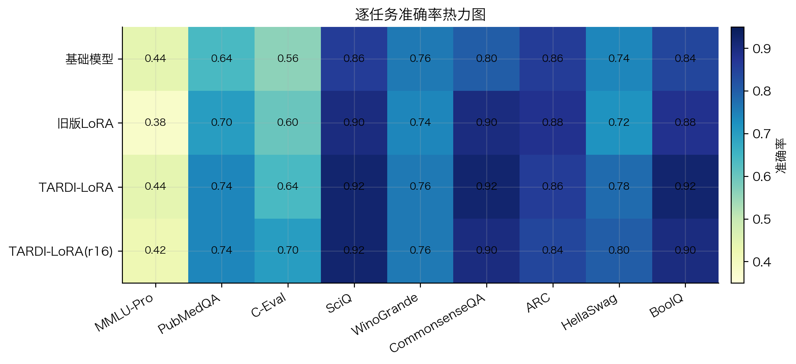
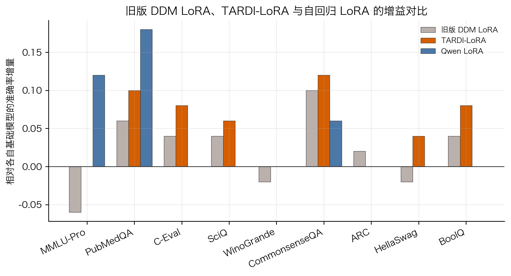
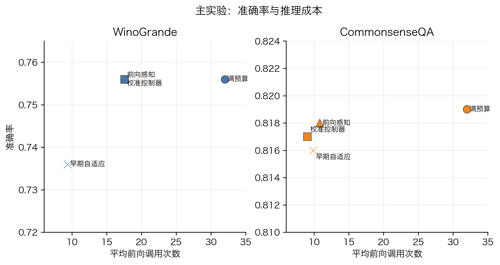
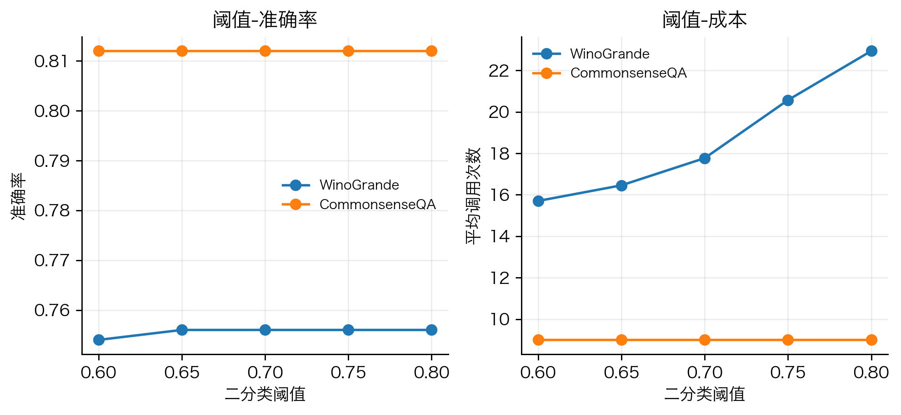
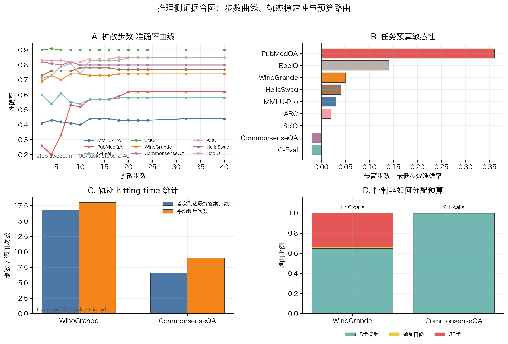
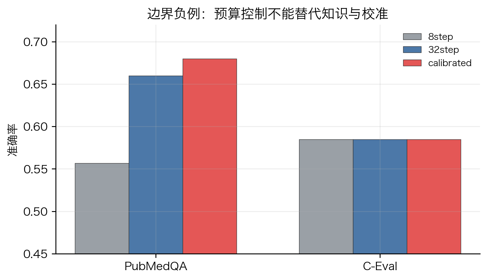
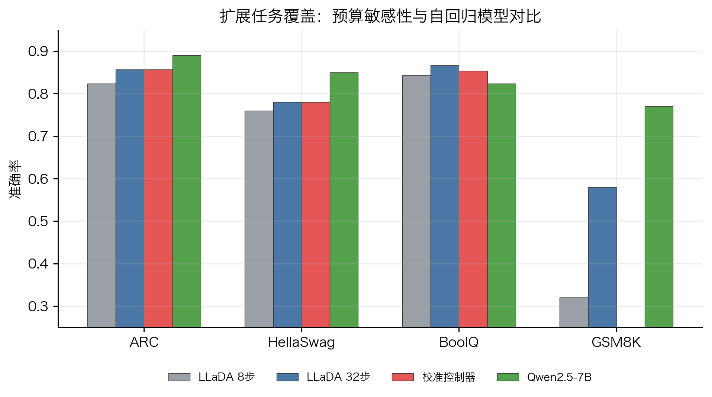
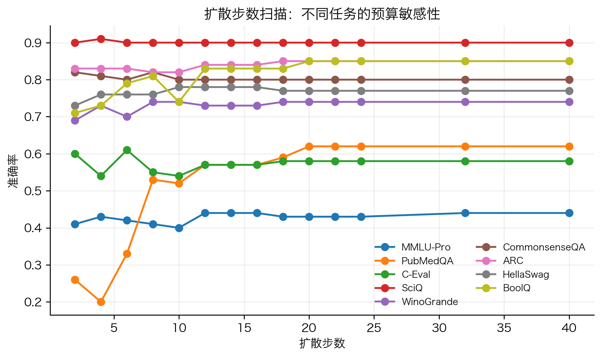

# 面向固定标签推理的掩码扩散语言模型适配与反向推理控制

## 摘要

本项目研究掩码扩散语言模型在固定标签下游任务中的训练适配与推理控制问题。与自回归语言模型不同，LLaDA 这类模型通过多步反向去噪从高噪声文本状态恢复答案，因此最终标签分布不仅由模型知识决定，也受到噪声阶段、反向扩散步数、标签轨迹稳定性和推理预算分配的影响。

本文围绕两个具体问题展开：第一，普通 LoRA 微调的训练分布和固定标签评测分布不一致；第二，固定步数采样无法适应不同样本的反向去噪难度。针对训练侧问题，我们设计了 TARDI-LoRA：通过任务均衡、评测去重和高噪声终标签去噪，使适配过程更贴近固定标签推理。该方法将 9 个任务的宏平均准确率从基础模型的 `0.722` 提升到 `0.776`，相比旧版 LoRA 的 `0.744` 也有稳定提升。针对推理侧问题，我们设计了校准的前向感知风险控制器与选择性再掩码修正机制，在 WinoGrande 和 CommonsenseQA 的 1000 样本主实验中，以显著更少的平均前向调用接近或保持 32 步满预算结果。

最终结论是：掩码扩散语言模型的下游能力边界既来自模型参数，也来自反向扩散轨迹本身。训练侧需要让数据覆盖、标签格式和噪声阶段与评测目标对齐；推理侧需要把固定采样过程改造成可观测、可校准、可控成本的决策过程。

## 核心创新点

本文的工程创新集中在训练侧适配和推理侧控制两个环节。

第一，提出面向固定标签推理的 TARDI-LoRA。该方法围绕选择题、判断题和医学三分类问答的固定标签空间构造训练信号，让 LoRA 更新更直接地作用在最终标签恢复过程上。具体做法包括任务均衡采样、评测样本去重、高噪声终标签去噪，以及与评测一致的 final-label 格式。它把普通 response-style LoRA 改成更贴近掩码扩散推理过程的 fixed-label denoising adaptation。

第二，提出选择性再掩码推理控制器。该控制器先用低预算反向轨迹获得样本级风险信号，再结合标签合法性、置信度边际和轨迹稳定性决定是否追加去噪预算。控制器只使用当前样本的在线信号；step sweep 曲线用于解释任务预算敏感性，不作为默认推理输入。

这两个设计对应固定标签任务中的两个核心错位：训练侧的标签恢复目标需要和扩散噪声阶段对齐，推理侧的采样预算需要和样本轨迹难度对齐。

## 研究问题

设输入为 $x$，固定标签空间为 $\mathcal{Y}(x)$，例如多选题的 A 到 D、判断题的 yes/no，或医学问答的 yes/no/maybe。自回归模型通常直接学习

```text
p(y | x)
```

而掩码扩散语言模型在推理时需要经过多步反向去噪，最终答案是一个多步转移过程后的 hitting distribution。简化地说：

```text
z_T -> z_{T-1} -> ... -> z_0 -> y
```

这带来两个问题：

1. 训练侧，普通 LoRA 更偏向一般文本去噪，固定标签位置上的最终决策边界得到的监督较弱。
2. 推理侧，固定 32 步或固定 8 步假设所有样本的反向去噪难度相同，但轨迹分析显示这个假设并不成立。

本文要回答的是：能否通过训练侧适配协议和推理侧风险控制，让 LLaDA 更稳定地服务于固定标签任务？

## 方法总览

方法由两部分组成。

第一部分是 TARDI-LoRA。它从训练数据、噪声阶段和标签格式三个方面对齐固定标签任务：

- 训练集覆盖评测中的 9 类任务，避免训练任务过窄。
- 训练样本与评测样本按编号去重，避免把评测样本混入训练。
- 在高噪声比例下训练终标签去噪，使训练阶段更接近 LLaDA 推理时从掩码答案恢复最终标签的状态。

第二部分是选择性再掩码推理控制。它先运行低预算侦察轨迹，再依据风险决定是否追加预算。若样本风险较低，则直接接受低预算答案；若风险较高，则对低置信位置、合法标签位置和 final-answer 标记附近位置再掩码，并追加反向去噪预算。

可以把推理策略写成一个带成本项的决策问题：

```text
K*(x) = argmin_K E[L(y_K, y*) | trajectory_8(x)] + lambda K
```

其中 $K$ 是反向扩散预算，$\lambda K$ 是推理成本。与单纯提前停止不同，我们关心的是由轨迹不确定性估计继续去噪的边际收益。



## 实验设置

主模型为 LLaDA-8B-Instruct。训练侧 LoRA 实验覆盖 9 个固定标签任务，每个任务 50 条评测样本，共 450 条。任务包括 MMLU-Pro、PubMedQA、C-Eval、SciQ、WinoGrande、CommonsenseQA、ARC-Challenge、HellaSwag 和 BoolQ。

推理控制主实验使用 WinoGrande 和 CommonsenseQA，各 1000 条样本。阈值稳定性实验使用每任务 500 条样本。边界负例使用 PubMedQA 和 C-Eval。扩展覆盖实验加入 ARC-Challenge、HellaSwag、BoolQ 和 GSM8K，以检查结论是否局限于原始选择题集合。轨迹分析补充到每任务 500 条、trace stride 为 1；步数扫描覆盖 9 个任务，每任务 100 条样本，包含 2、4、6、8、10、12、14、16、18、20、22、24、32、40 共 14 个扩散步点。

所有关键输出统一整理在：

```text
writing/tables/
writing/figures/
```

## 训练侧创新：TARDI-LoRA

TARDI-LoRA 的设计目标是增强 LLaDA 对固定标签任务的适配能力。普通 LoRA 容易把监督分散到完整回答文本上，TARDI-LoRA 将训练重点收束到最终标签恢复过程：

1. 任务均衡采样覆盖 9 类评测任务，减少单一任务分布对 LoRA 更新的主导。
2. 评测样本按编号去重，保证适配结果来自训练分布设计。
3. 高噪声终标签去噪将答案位置置于更接近推理初始阶段的掩码状态，使 LoRA 在高不确定状态下学习恢复合法标签。
4. final-label 格式让训练和评测共享同一类输出空间，减少格式化回答对准确率的干扰。

图 1 展示了训练侧主要消融。基础 LLaDA 在 9 个任务上的宏平均准确率为 `0.722`。旧版 LoRA 达到 `0.744`。仅做任务均衡后提升到 `0.760`。加入高噪声终标签去噪后，TARDI-LoRA 达到 `0.776`，与 r16 配置相同。



| 方法 | 正确数 | 样本数 | 宏平均准确率 | 相对基础模型 |
|---|---:|---:|---:|---:|
| 基础模型 | 325 | 450 | 0.722 | +0.000 |
| 旧版 LoRA | 335 | 450 | 0.744 | +0.022 |
| 任务均衡 LoRA | 342 | 450 | 0.760 | +0.038 |
| TARDI-LoRA | 349 | 450 | 0.776 | +0.053 |
| TARDI-LoRA(r16) | 349 | 450 | 0.776 | +0.053 |

这个结果支持一个比较稳的训练侧主张：固定标签任务中的 DDM LoRA 需要优先处理训练覆盖、噪声阶段和评测格式的对齐。TARDI-LoRA 的核心价值正在于这种对齐。

逐任务结果如图 2 所示。TARDI-LoRA 在 PubMedQA、SciQ、CommonsenseQA、HellaSwag、BoolQ 等任务上有稳定收益；MMLU-Pro 的收益有限，说明 LoRA 适配主要改善固定标签决策和格式化推理，知识密集任务仍需要额外数据或检索增强。



下表给出 9 个数据集上的主结果。这个表适合放进 PPT，用于展示改进后的 LLaDA LoRA 相对基础模型和旧版 LoRA 的增量。

| 数据集 | LLaDA 基础模型 | 旧版 LoRA | TARDI-LoRA | TARDI 增益 |
|---|---:|---:|---:|---:|
| MMLU-Pro | 0.44 | 0.38 | 0.44 | +0.00 |
| PubMedQA | 0.64 | 0.70 | 0.74 | +0.10 |
| C-Eval | 0.56 | 0.60 | 0.64 | +0.08 |
| SciQ | 0.86 | 0.90 | 0.92 | +0.06 |
| WinoGrande | 0.76 | 0.74 | 0.76 | +0.00 |
| CommonsenseQA | 0.80 | 0.90 | 0.92 | +0.12 |
| ARC | 0.86 | 0.88 | 0.86 | +0.00 |
| HellaSwag | 0.74 | 0.72 | 0.78 | +0.04 |
| BoolQ | 0.84 | 0.88 | 0.92 | +0.08 |
| 宏平均 | 0.722 | 0.744 | 0.776 | +0.053 |

## 与自回归 LoRA 的对照

为了回答“改进后的扩散模型 LoRA 与自回归 LoRA 相比如何”，我们补跑了 9 个任务上的 Qwen2.5-7B LoRA 对照，并和旧版 DDM LoRA、TARDI-LoRA 放在同一张表里。这个对照用于评估改进后的训练方式相对旧版 LoRA 的提升幅度，以及它和自回归 LoRA 增益的关系。

| 数据集 | LLaDA 基础模型 | 旧版 DDM LoRA | 旧版 DDM LoRA 增益 | TARDI-LoRA | TARDI 增益 | Qwen 基础模型 | Qwen LoRA | Qwen LoRA 增益 |
|---|---:|---:|---:|---:|---:|---:|---:|---:|
| MMLU-Pro | 0.44 | 0.38 | -0.06 | 0.44 | +0.00 | 0.42 | 0.54 | +0.12 |
| PubMedQA | 0.64 | 0.70 | +0.06 | 0.74 | +0.10 | 0.58 | 0.76 | +0.18 |
| C-Eval | 0.56 | 0.60 | +0.04 | 0.64 | +0.08 | 0.74 | 0.74 | +0.00 |
| SciQ | 0.86 | 0.90 | +0.04 | 0.92 | +0.06 | 0.90 | 0.90 | +0.00 |
| WinoGrande | 0.76 | 0.74 | -0.02 | 0.76 | +0.00 | 0.70 | 0.70 | +0.00 |
| CommonsenseQA | 0.80 | 0.90 | +0.10 | 0.92 | +0.12 | 0.78 | 0.84 | +0.06 |
| ARC | 0.86 | 0.88 | +0.02 | 0.86 | +0.00 | 0.92 | 0.92 | +0.00 |
| HellaSwag | 0.74 | 0.72 | -0.02 | 0.78 | +0.04 | 0.78 | 0.78 | +0.00 |
| BoolQ | 0.84 | 0.88 | +0.04 | 0.92 | +0.08 | 0.88 | 0.88 | +0.00 |
| 宏平均 | 0.722 | 0.744 | +0.022 | 0.776 | +0.053 | 0.744 | 0.784 | +0.040 |



这张表给出的结论更清楚：旧版 DDM LoRA 在 9 个任务上的平均增益为 `+0.022`，TARDI-LoRA 提升到 `+0.053`；Qwen LoRA 的平均增益为 `+0.040`，最终宏平均准确率为 `0.784`，略高于 TARDI-LoRA 的 `0.776`。任务分布上，Qwen LoRA 的收益集中在 MMLU-Pro、PubMedQA 和 CommonsenseQA；TARDI-LoRA 在 PubMedQA、C-Eval、SciQ、CommonsenseQA、HellaSwag 和 BoolQ 上都超过旧版 DDM LoRA。这个结果说明，固定标签任务中的 DDM LoRA 收益取决于训练目标、噪声阶段和评测格式的共同设计。

## 推理侧结果：校准风险控制

在 1000 样本主实验中，32 步满预算是强基线。早期自适应方法很省算力，但在 WinoGrande 上准确率从 `0.756` 降到 `0.736`。校准控制器在 WinoGrande 上保持 `0.756`，平均调用次数从 32 降到 `17.56`；在 CommonsenseQA 上达到 `0.817`，接近 32 步的 `0.819`，平均调用次数降到 `9.064`。



| 方法 | 任务 | 准确率 | 正确数 | 样本数 | 平均调用次数 |
|---|---|---:|---:|---:|---:|
| 32 步满预算 | WinoGrande | 0.756 | 756 | 1000 | 32.00 |
| 32 步满预算 | CommonsenseQA | 0.819 | 819 | 1000 | 32.00 |
| 早期自适应 | WinoGrande | 0.736 | 736 | 1000 | 9.36 |
| 早期自适应 | CommonsenseQA | 0.816 | 816 | 1000 | 9.86 |
| 前向感知 | WinoGrande | 0.756 | 756 | 1000 | 17.56 |
| 前向感知 | CommonsenseQA | 0.818 | 818 | 1000 | 10.82 |
| 校准控制器 | WinoGrande | 0.756 | 756 | 1000 | 17.56 |
| 校准控制器 | CommonsenseQA | 0.817 | 817 | 1000 | 9.06 |

配对检验也支持这一点。校准控制器与 32 步满预算相比，在 WinoGrande 上两边各只独有 3 个正确样本，McNemar 检验 $p=1.0$。在 CommonsenseQA 上，32 步独有 8 个正确样本，控制器独有 6 个正确样本，$p=0.7905$。与早期自适应相比，校准控制器在 WinoGrande 上显著更好，$p=0.0225$。

## 阈值稳健性

阈值扫描表明，控制器对阈值变化较稳健。WinoGrande 中，阈值从 0.60 到 0.80 时，准确率基本保持在 `0.754` 到 `0.756`，调用次数随阈值升高从 `15.70` 增加到 `22.94`。CommonsenseQA 在这些阈值下准确率稳定为 `0.812`，平均调用次数约为 9。



这说明阈值主要调节控制器的保守程度，结果并不依赖某一个偶然的取值。

## 轨迹分析

轨迹记录器补充到每任务 500 条样本、每一步都记录一次。结果显示，不同任务达到最终答案的时间分布明显不同。CommonsenseQA 的平均首次到达最终答案步数为 `6.57`，而 WinoGrande 为 `16.81`。WinoGrande 的平均调用次数为 `18.01`，CommonsenseQA 为 `9.00`。这说明 WinoGrande 更依赖较长的语义绑定过程，CommonsenseQA 更容易在早期形成稳定标签。



这张合图把三类证据放在同一页：任务准确率随扩散步数的变化、任务预算敏感性、轨迹 hitting-time 统计，以及控制器实际路由分布。它支撑了选择性再掩码控制的理论动机：统一固定步数并不合理，反向扩散预算应由轨迹风险决定。

## 推理侧创新：选择性再掩码控制器

选择性再掩码控制器把 LLaDA 的反向扩散推理过程看作一个带成本的决策过程。它包含三个步骤：

1. 用低预算轨迹获得初始答案和置信度。
2. 根据标签合法性、置信度、边际差、答案翻转和任务统计估计风险。
3. 对低置信位置重新掩码，追加中等或满预算去噪。

控制器可以解释为样本级风险收益决策。给定低预算侦察轨迹，策略选择使下式较小的预算：

$$
J(K \mid x)
=
R(x)
+
\lambda C(K)
$$

其中 $R(x)$ 是由探针不确定性、标签合法性、轨迹翻转和填充置信度组成的样本风险，$C(K)$ 是计算成本。step sweep 曲线只用于画出不同任务的预算敏感性，帮助解释为什么同一个固定步数不适合所有任务。

这种机制会在轨迹稳定的样本上节省预算，在高风险样本上保守回退。9 任务快速覆盖实验中，选择性再修控制器与 32 步满预算的宏平均准确率相同，均为 `0.658`，平均调用次数从 `32.00` 降到 `26.92`。相比固定 16 步调度的 `0.644` 和早停式方法的 `0.647`，选择性再修更稳。

| 方法 | 9 任务宏平均准确率 | 平均调用次数 |
|---|---:|---:|
| 32 步满预算 | 0.658 | 32.00 |
| 固定 16 步调度 | 0.644 | 16.00 |
| 早停式方法 | 0.647 | 30.44 |
| 选择性再修控制器 | 0.658 | 26.92 |

我们还尝试了更细粒度的 4-step online 控制。该方法按 `4 -> 8 -> 12 -> ... -> 32` 逐段判断是否继续。小样本结果显示，它在 CommonsenseQA 上保持 `0.850`，但平均调用升到 `11.00`；在 WinoGrande 上降到 `0.700`，平均调用升到 `18.50`。这个负结果说明，细粒度控制不能只靠反复重掩码实现，因为重掩码会扰动已经稳定的答案轨迹。最终主方法仍采用 8-step scout + 风险门控再修。

为避免只挑一个看起来合理的机制，我们还测试了 trajectory-probe cascade、保守 probe cascade、双 schedule ensemble、answer-consistency remask、gentle/aggressive remask 等候选。小样本筛选中，trajectory-probe cascade 在 WinoGrande 上只有 `0.700 / 12.55`，schedule ensemble 为 `0.750 / 16.80`，保守 probe cascade 为 `0.750 / 25.00`。answer-consistency remask 会在探针与 scout 答案一致时保护答案 token，在强分歧时优先修复答案区域；它触发了 11 次 refinement，但最终仍为 WinoGrande `0.800 / 14.20`、CommonsenseQA `0.850 / 8.90`。gentle remask 与默认风险门控相同，WinoGrande `0.800 / 14.20`，CommonsenseQA `0.850 / 8.90`。因此当前最稳的解码机制仍是：prompt probe 先发现必须满预算的样本，8-step scout 估计轨迹风险，低置信再掩码只用于风险样本。

随后我们把 gentle risk-gated remask 扩大到每任务 100 条样本验证。WinoGrande 达到 `0.740`，平均调用 `13.91`；CommonsenseQA 达到 `0.800`，平均调用 `9.92`。路由没有退化：WinoGrande 中 59% 样本停在 8 步，24% 到 16 步，12% 到 24 步，5% 到 32 步；CommonsenseQA 中 76% 停在 8 步，20% 到 16 步，2% 到 24 步，2% 到 32 步。这说明控制器确实在做样本级预算分配。它的价值主要体现在节省调用并守住强基线行为边界，不能写成凭空提升模型知识能力。

在 LoRA 后模型上，选择性再修也保留了主要收益。已有 LoRA 控制实验中，LoRA 32 步为 `0.744`，LoRA 加控制器为 `0.742`，平均调用次数为 `25.24`，约减少 21% 的调用。这一实验使用的是早期 LoRA 检查点，后续最自然的扩展是在 TARDI-LoRA 检查点上复测同一控制器。

## 边界负例

PubMedQA 和 C-Eval 给出了清晰的边界。PubMedQA 从 8 步 `0.557` 到 32 步 `0.660`，说明医学判断任务对反向轨迹预算敏感；校准控制器在该任务上选择全 32 步，准确率 `0.680`。C-Eval 中 8 步和 32 步都为 `0.585`，说明瓶颈更像知识缺口或专业领域能力，继续增加采样步数也难以解决。



因此本文的边界非常明确：采样控制适合处理轨迹敏感型错误；知识缺口和领域能力仍需要数据、检索或训练侧增强。

## 扩展任务覆盖

扩展任务显示，预算敏感性并不只出现在 WinoGrande 和 CommonsenseQA。GSM8K 从 8 步到 32 步提升 26 个百分点，说明长链数值推理高度依赖反向预算；ARC-Challenge、HellaSwag 和 BoolQ 也有 2 到 3 个点的 32 步收益。另一方面，Qwen2.5-7B 在 ARC、HellaSwag 和 GSM8K 上更强，说明 LLaDA 并非全面优于自回归模型。



步数扫描进一步说明，不同数据集的准确率随扩散步数变化并不一致。在 9 个任务、每任务 100 条样本的 14 点扫描中，PubMedQA 从 2 步到 40 步提升 `+0.36`，BoolQ 提升 `+0.14`，WinoGrande 提升 `+0.05`；ARC、HellaSwag 和 MMLU-Pro 有较小收益；SciQ 基本不受步数影响，CommonsenseQA 在低步数已经饱和。该图主要用于展示形态差异，不单独承担最终准确率结论；最终性能仍以 1000 样本主实验和 500 样本轨迹统计为主。



这使得本文主张更加具体：LLaDA 的价值来自反向轨迹的可观测性、可分析性和可控成本特征。它在部分任务上能通过预算控制获得更高效的推理过程，但在知识密集和复杂推理任务上仍需要训练侧适配或更强的基础模型。

## 理论解释

从离散扩散角度看，LLaDA 的反向推理可以看作在离散 token 状态空间上的反向马尔可夫过程。固定步数采样默认每个样本的 hitting time 分布相近，但实验显示不同任务的首次到达最终答案步数、标签翻转次数和后期不稳定性不同。

因此选择性再掩码控制器可以解释为带成本的风险最小化：

```text
R(pi) = E[1{y_pi(x) != y*}] + lambda E[C_pi(x)]
```

其中策略 $\pi$ 根据低预算轨迹选择继续去噪的位置和预算。TARDI-LoRA 作用在训练侧，使适配阶段更接近固定标签评测中的高噪声答案恢复过程。两者分别处理训练分布错位和推理预算错位。

## 最终贡献表述

汇报中可以将贡献压缩为三点：

1. 提出 TARDI-LoRA。它通过任务均衡、评测去重和高噪声终标签去噪，修正掩码扩散模型在固定标签推理中的训练与评测错位。
2. 提出选择性再掩码推理控制。它利用低预算反向轨迹估计样本风险，在保持满预算行为边界的同时减少平均推理成本。
3. 给出系统边界分析。通过 PubMedQA、C-Eval、GSM8K 和扩展任务实验区分轨迹敏感错误、知识缺口和长链推理瓶颈，并从反向轨迹和任务预算需求解释 LLaDA 与自回归模型的差异。

## 面向展示的结论

如果做 PPT，可以把主线压缩成一句话：

> 在固定标签任务中，TARDI-LoRA 让训练过程更贴近高噪声答案恢复，选择性再掩码控制让反向扩散轨迹变得可观测、可校准、可控成本。训练侧解决对齐问题，推理侧解决预算分配问题。

## 文件索引

图表：

```text
writing/figures/
```

整理后的数据表：

```text
writing/tables/
```

原始主要数据：

```text
results/domain_shift/task_aware/lora_opt_v1/
results/domain_shift/task_aware/solid_v2/
results/domain_shift/task_aware/choice_noise_v1/
```
